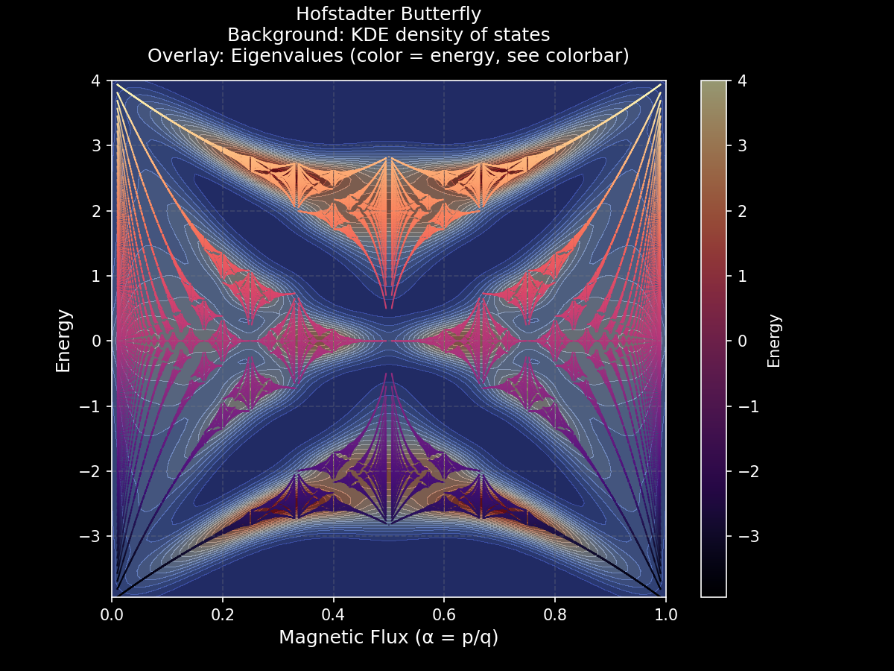

# 🦋 The Hofstadter Butterfly

## 📖 Historical Context

The **Hofstadter butterfly** is a famous fractal pattern discovered by physicist **Douglas Hofstadter** in 1976. It appears when studying electrons on a **two-dimensional lattice** under a **perpendicular magnetic field**.

This system can be modeled using the **Harper Hamiltonian**, which describes electrons hopping between lattice sites under an applied magnetic flux. When the **magnetic flux per plaquette** is a rational number `alpha = p/q` (with `p` and `q` coprime), the spectrum splits into **q subbands**, forming a rich, self-similar pattern resembling a butterfly.

This fractal spectrum connects to:

* **Bloch electrons in a magnetic field**
* **Quasicrystals**
* **Quantum Hall effect**
* **Topological phases of matter**

---

## ⚛️ Implementation (1D Harper / Aubry-André-Harper Model)

This project reproduces the Hofstadter butterfly using a **one-dimensional chain of q sites** with a **quasiperiodic potential** controlled by `alpha`.

The Hamiltonian is based on the **Harper model** (originally 2D) and its **1D quasiperiodic version**, known as the **Aubry-André model**. In modern literature, this 1D formulation is often referred to as the **Aubry-André-Harper (AAH) model**.

### The Aubry-André-Harper Hamiltonian

For a system with q sites, the Hamiltonian matrix is defined as:

$$
H_{mn} =
\begin{cases}
2 \cos(2 \pi \alpha n), & \text{if } m = n \\
1, & \text{if } m = n+1 \text{ or } m = n-1 \\
0, & \text{otherwise}
\end{cases}, \quad m,n = 0,1,\dots,q-1
$$

**Periodic boundary conditions** are applied: \(H_{0,q-1} = H_{q-1,0} = 1\)

**Key points:**

* The system is **1D**, representing a chain of `q` sites.
* `2 * cos(2 * pi * alpha * n)` is the **on-site quasiperiodic potential**.
* Off-diagonal terms `1` represent **nearest-neighbor hopping**.
* **Periodic boundary conditions**: `H[0, q-1] = H[q-1, 0] = 1`.
* Eigenvalues of this matrix are the **allowed energy levels**.

Plotting eigenvalues versus `alpha` in `[0,1]` produces the **Hofstadter butterfly**, reproducing the same fractal pattern as the original 2D Harper model.



---

## 🧮 Building It in Python

This repository provides a **parallelized Python implementation** using the 1D Harper/Aubry-André-Harper Hamiltonian.

**Steps:**

1. **Construct the Hamiltonian**

   * For a given `q` and `alpha = p/q`, build the Hamiltonian matrix.
   * Use NumPy for fast vectorized operations.

2. **Filter coprime pairs**

   * Only consider `p` and `q` coprime, to avoid redundant spectra.

3. **Compute all eigenvalues**

   * For denominators `q <= max_q`, compute the full set of eigenvalues.

4. **Parallelization**

   * Distribute computations using `joblib`.

5. **Visualization**

   * Scatter plot of eigenvalues (`alpha` vs. energy).
   * KDE density heatmap to show regions of high density of states.

---

## 🛠️ Function Reference

### `hofstadter_hamiltonian(q, alpha)`

* Constructs the **q × q Harper/Aubry-André-Harper Hamiltonian** for flux `alpha = p/q`.
* Returns **sorted eigenvalues**.
* Uses **NumPy vectorized operations** for efficiency.

---

### `compute_eigenvalues(p, q)`

* Computes eigenvalues for a single pair `(p, q)` if `gcd(p, q) = 1`.
* Returns:

  * `alphas`: array of `alpha = p/q` repeated for each eigenvalue
  * `energies`: array of corresponding eigenvalues
* Ensures only **coprime pairs** are considered, avoiding duplicates.

---

### `compute_q(q)`

* Computes eigenvalues for all valid numerators `p` for a given denominator `q`.
* Aggregates results into **flattened arrays** of `alphas` and `energies`.

---

### `generate_hofstadter_spectrum(max_q)`

* Generates the **full Hofstadter spectrum** for all `alpha = p/q` with denominators `q <= max_q`.
* Uses **joblib** to parallelize computations across CPU cores.
* Returns:

  * `alphas`: all magnetic flux values
  * `energies`: corresponding eigenvalues

---

### `plot_hofstadter_butterfly(alphas, energies, cfg)`

* Plots the **Hofstadter butterfly** spectrum.
* Two visualization layers:

  1. **KDE density heatmap** (background)
  2. **Scatter overlay** of actual eigenvalues, colored by energy
* Supports **configurable figure size, DPI, color maps, and KDE bandwidth**.

---

### `Config` (dataclass)

* Holds plotting and computation parameters:

  * `max_q` – maximum denominator for fluxes
  * `grid_res` – resolution of KDE heatmap
  * `bw_method` – KDE bandwidth
  * `figsize`, `dpi` – plot size and resolution
  * `cmap_kde`, `cmap_scatter` – color maps for background and scatter overlay

---

## 📊 Visualization

The output combines **two layers**:

1. **KDE Density Heatmap (background)**

   * Represents **density of states** in the `(alpha, E)` plane.
   * Bright regions = high density (energy bands), dark regions = gaps.

2. **Scatter Overlay (points)**

   * Each point `(alpha, E)` corresponds to an **actual eigenvalue**.
   * Color encodes energy `E`.
   * Ensures both **raw spectrum** and **smoothed density** are visible.

> *Note: KDE heatmap uses Gaussian kernel density estimation; it highlights density, not exact pixel values.*

---

## 🚀 Usage

### Install dependencies

```bash
pip install numpy matplotlib joblib scipy
```

### Run the script

```bash
python hofstadter.py
```

### Parameters

* `max_q`: max denominator for rational fluxes (higher = more detail).
* `grid_res`: resolution of KDE heatmap.

---

## ⚡ Performance Notes

* **Parallelization**: CPU cores used via `joblib`.
* **Vectorization**: NumPy used for matrix operations.
* **Memory-efficient concatenation**: avoids Python list overhead.

This allows `max_q` values up to 150 or more without excessive runtime.

---

## ✨ Conclusion

With just a few lines of Python, you can generate your own **Hofstadter butterflies**, visualize the **density of states**, and explore the fractal spectrum of quantum systems under magnetic fields. This project demonstrates the deep connections between **quantum mechanics**, **topology**, and **fractal geometry** in a fully accessible 1D model.

---

## 📚 References

* D. R. Hofstadter, *“Energy levels and wave functions of Bloch electrons in rational and irrational magnetic fields”*, Phys. Rev. B **14**, 2239 (1976).
* M. Kohmoto, B. Sutherland, and C. Tang, *“Critical wave functions and a Cantor-set spectrum of a one-dimensional quasicrystal model”*, Phys. Rev. B **35**, 1020 (1987).
